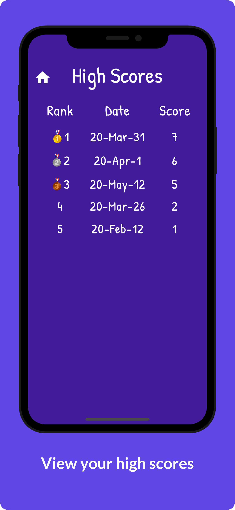

# Hangman
A hangman game written in Dart with Flutter framework. Player has 5 lives in each turn. Previous scores can be viewed in High Scores page.

## Screenshots

App screenshots created with <a href="https://previewed.app/">Previewed</a>

## License

Released under MIT License. See [LICENSE](LICENSE) for more info.
